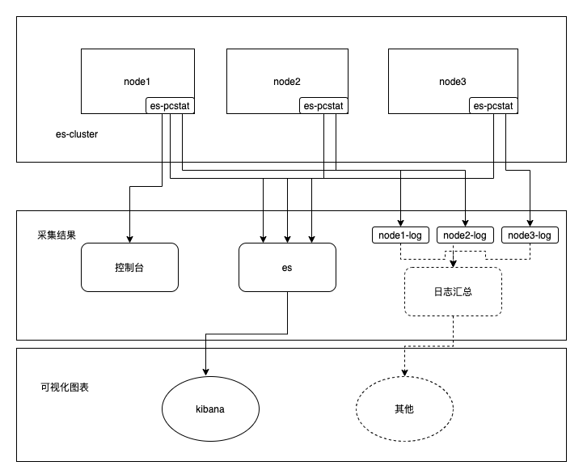
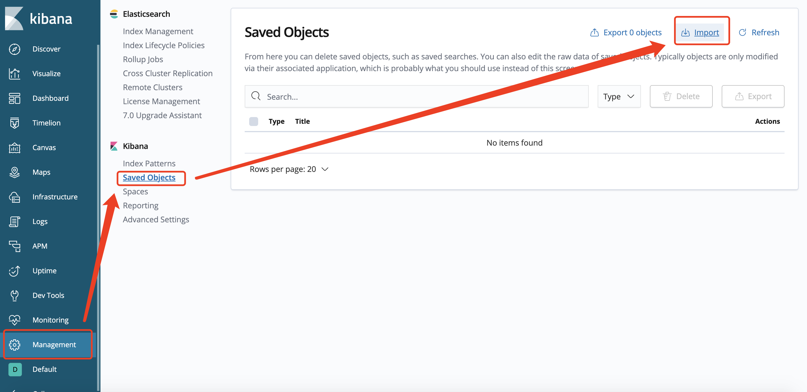
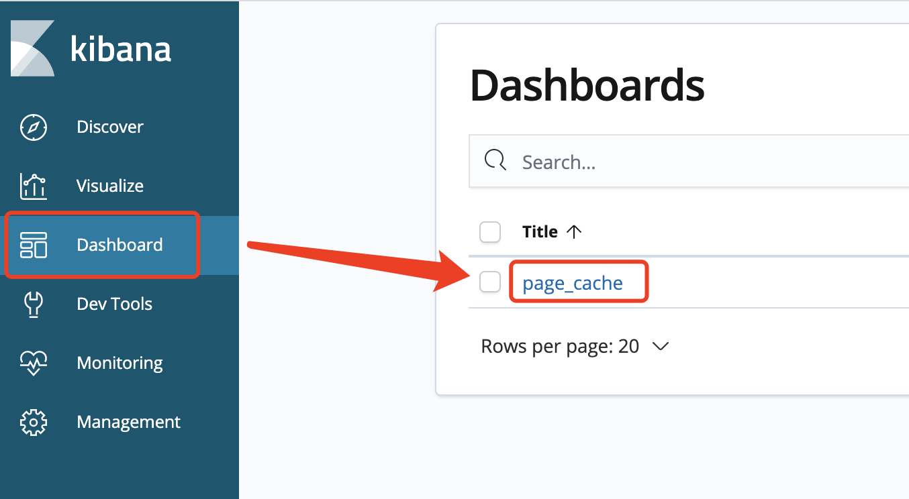
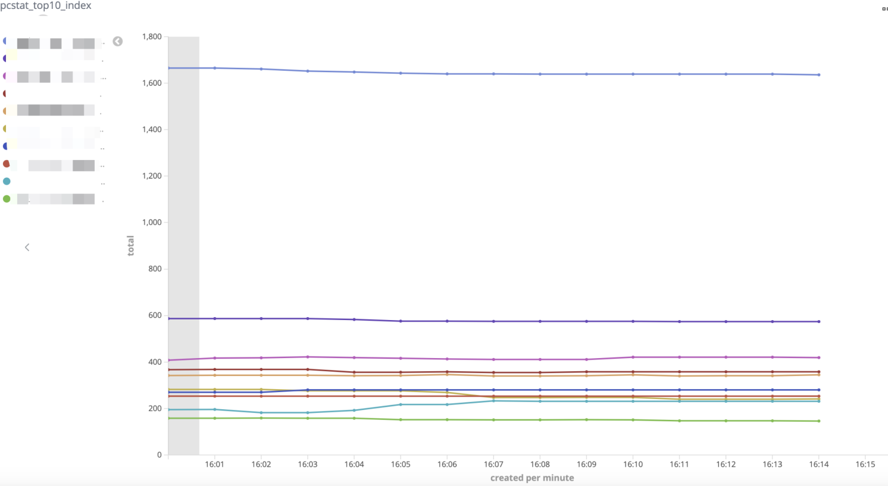
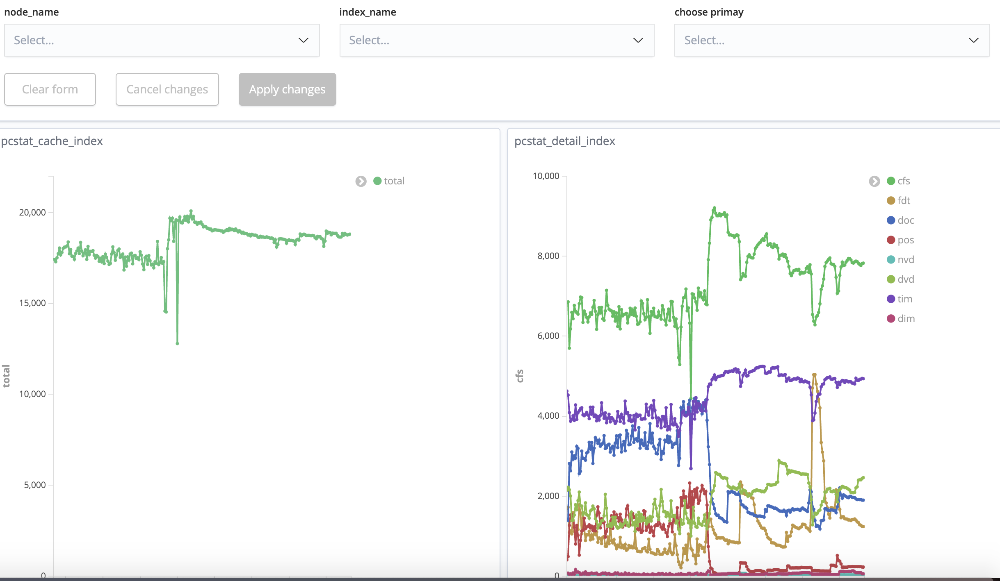

统计elasticsearch各索引涉及文件page cache的大小，通过各索引page cache曲线可预测索引行为。
​


### 功能点

- 数据输出：控制台、日志和es
    - 控制台：查看各索引cache（支持排序）
    - 日志和es：支持采集 按节点、索引、主副分片、文件后缀拆分统计
- 可视化：支持kibana查看，导出图表
    - 支持按节点、索引、主副分片类型筛选查看
    - 支持查看索引page cache top10波动曲线
- 其他：
    - 支持配置采集索引前缀
- cache单位： MB


- 系统环境： 类unix、linux环境
- es版本：es 6.x  es7.x
#### 
### 获取可执行文件
#### linux_x64
linux 64位可通过如下命令获取可执行文件
```json
curl -L -o es-pcstat es-pcstat-linux-x64
chmod 755 es-pcstat
```
#### mac
mac 64位可通过如下命令获取可执行文件
```json
curl -L -o es-pcstat es-pcstat-drawin-x64
chmod 755 es-pcstat
```
其余环境需要自行编译
### 运行
#### 配置文件
配置文件必须需填写es ip、端口、节点名、集群名和数据目录

| 名称 | 描述 | 默认值 | 必填 |
| --- | --- | --- | --- |
| es.ip | 采集的es节点ip |  |Yes |
| es.port | 采集的es节点端口 |  | Yes |
| es.indicesPath | 采集的es节点indices目录，一般为"${data.path}/nodes/0/indices" |  | Yes |
| es.nodeName | 采集的es节点名 |  | Yes |
| es.clusterName | 采集的es集群名 |  | Yes |
| es.collection.indicesPrefix | 需采集的索引名前缀，不填则采集全部；样例：pcstat |  |  |
| output.log.keepLogNum | 针对日志形式输出生效，保留日志文件个数（按天拆分） | 5 |  |
| output.log.logPath | 针对日志形式输出生效，日志全路径 | /tmp/pcstat.log |  |
| output.es.keepIndexNum | 针对es输出生效，保留索引个数（按天拆分） | 5 |  |
| output.es.pcIndexName | 针对es输出生效，索引名（如需使用kibana仪表盘配置请勿修改） | pc_stat |  |


```conf
#es conf
es.ip=127.0.0.1
es.port=9200
es.indicesPath=/xxx/xxx/elasticsearch-6.7.1/data/nodes/0/indices
es.nodeName=node1
es.clusterName=es_local

#采集索引前缀,设置为空则采集全部
es.collection.indicesPrefix=

#该配置仅日志输出生效 output log,保留个数单位为天
output.log.keepLogNum=5
output.log.logPath=/tmp/pcstat.log

#该配置仅es输出生效 output es,保留个数单位为天
output.es.keepIndexNum=5
output.es.pcIndexName=pc_stat
```
#### 控制台输出
使用命令
```shell
./es-pcstat -collectIntervalFlag=30 -sortFlag=true ./es.conf
```
结果：
```json


| index_name                            | cache (MB) | pri cache  | rep cache  |
+---------------------------------------+------------+------------+------------+
| fusion-media.task.task                |  247       |  247       |  0         |
| total                                 |  247       |  247       |  0         |
+---------------------------------------+------------+------------+------------+

```
#### 日志输出
使用命令
```shell
./es-pcstat -outputTypeFlag=log ./es.conf
```
对应日志文件得到内容：
```json
{"cache":{"cfs":0,"dim":0,"doc":0,"dvd":0,"fdt":0,"nvd":0,"other":0,"pos":0,"tim":0,"total":0},"cluster_name":"es_local","fields.time":"2021-05-06T15:16:30.525475+08:00","index_name":"total","level":"info","msg":"","node_name":"node1","primary":false,"time":"2021-05-06T15:16:30"}
```
#### 
#### es输出
命令：
```json
./es-pcstat -outputTypeFlag=es ./es.conf
```
运行后会将采集到的数据写入采集的es节点，可导入kibana仪表盘配置文件，通过图表进行page cache分析。
[es-pcstat-kibana.json](other/es-pcstat-kibana.json)
导入方式：



导入后打开dashboards菜单栏，page_cache仪表盘


可查看如下图表：

* cache占用top10的索引波动图
  

* cache详细信息，可筛选节点、索引、主副分片，不选择展示合计数据。
  

注：
1. 如需使用上述kibana仪表盘导入文件，请勿修改conf文件中的pcIndexName以及运行命令的collectIntervalFlag，修改pcIndexName会导致仪表盘读不到数据，修改collectIntervalFlag会导致仪表盘聚合数据异常。
2. kibana7.5后Date Histogram的interval有所调整，会导致时间拉长后interval成倍增大，统计值不准，建议选取时间范围在4-6小时内。
   [https://elasticsearch.cn/question/11062](https://elasticsearch.cn/question/11062)

#### 可选参数
```
  -collectIntervalFlag int
    	采集间隔 (default 60)
  -outputTypeFlag string
    	数据输出方式 [es, log, console] (default "console")
  -sortFlag
    	仅对console类型生效，结果按page cache大小排序
```


### 自行编译


进入es-pcstat工程的es-pcstat目录，执行go build（需要安装go环境），成功后目录下生成es-pcstat可执行文件
```shell
git clone https://github.com/zhangdapao995/es-pcstat.git
cd es-pcstat/es-pcstat
go build
chmod 755 es-pcstat
```
